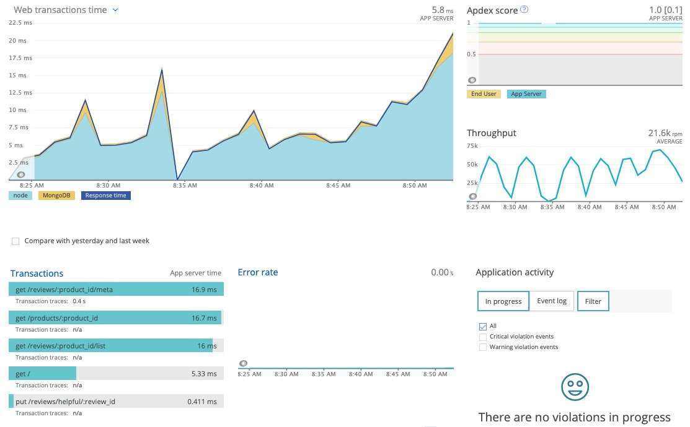

# Sidecountry Shop
> About
Sidecountry is an apparel shopping website styled to be mobile-first. This repo is the Reviews Service element of the app which showcases my skill set in Web Scale and Back-end optimization.


The app provides stats and commentary from previous customers as well as the ability to contribute additional reviews, mark as helpful, and flag reviews.

## My Contribution to this Project
I was given a legacy Front-end codebase and tasked with designing a scalable back-end that could maintain performance/resilience under production-level traffic.
  - High level deliverables:
    > Built an API to support CRUD operations to fit legacy code that conform to REST standards
    > Emulated scenarios of production-level traffic by:
      * Generated a simulated dataset of 10 million realistic JSON/BSON records
      * Stress tested queries that utilize thorough scenario coverage via Artillery.io load tester
    > Horizontally scaled app on AWS Round-Robin load balancers and optimized performance under load while deployed to meet the following benchmarks:
      * Response time: 50(ms)   * Requests Per Second: 100+   * Error rate: < 1%

# System Design / Web Scale Metrics

### New Relic APM


### Artillery.io


## Related Projects
- https://github.com/sidecountry-shop/productDetails
- https://github.com/sidecountry-shop/QnA

## Getting Started
Prerequisites: NodeJS and Xcode

Clone the Github repository:
```
$ git clone https://github.com/sidecountry-shop/reviewsService.git
```

cd into the directory 'reviewsService' and run the following commands:

```
$ npm install
$ npm start
```
Now, navigate to http://localhost:3004 in your browser


## Built With
* React
* Node.js
* Express
* MongoDB
